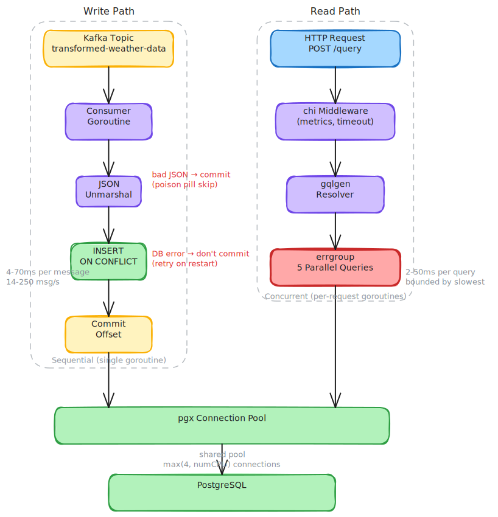

# Performance

This page describes the theoretical performance characteristics of the Storm Data GraphQL API: how requests flow through the system, where time is spent, and what the bottlenecks are.

## Architecture Overview



The service runs two concurrent workloads in a single process:

```
Write path:  Kafka topic --> Consumer goroutine --> INSERT --> PostgreSQL
Read path:   HTTP request --> chi middleware --> gqlgen --> parallel SQL queries (errgroup) --> JSON response
```

The Kafka consumer and HTTP server share the same pgx connection pool but otherwise operate independently.

## Read Path: Query Performance


### Per-Request Cost Breakdown

Each `stormReports` GraphQL query supports up to 2 filters. Per filter, the resolver executes **5 database queries in parallel** via `errgroup`:

| Query | Purpose | Typical Latency |
|---|---|---|
| `SELECT ... ORDER BY ... LIMIT/OFFSET` | Paginated report data (24 columns) + inline `COUNT(*)` | 2--50 ms (depends on result set size and filters) |
| `GROUP BY type` | Count by event type | 1--5 ms (small cardinality: 3 types) |
| `GROUP BY location_state, location_county` | Count by state and county | 2--20 ms (varies with geographic spread) |
| `GROUP BY time_bucket` | Count by hour | 1--10 ms |
| `SELECT MAX(processed_at)` | Last data update timestamp (shared across filters) | 1--5 ms |
| **Total (parallel)** | | **~2--50 ms** per filter |

All queries share the same dynamically-built `WHERE` clause. Independent queries run in parallel via `errgroup`, so total latency is bounded by the slowest query rather than the sum. Multiple filters are also executed in parallel.

### Index Coverage

Six indexes cover the primary query patterns:

| Index | Columns | Covers |
|---|---|---|
| `idx_begin_time` | `begin_time` | Time range filters (always present) |
| `idx_type` | `type` | Type filter |
| `idx_state` | `location_state` | State filter |
| `idx_severity` | `measurement_severity` | Severity filter |
| `idx_type_state_time` | `type, location_state, begin_time` | Combined type + state + time filter |
| `idx_geo` | `geo_lat, geo_lon` | Bounding-box pre-filter for radius queries |

Radius queries use a two-stage approach: a bounding-box `BETWEEN` filter (index-assisted) followed by an exact haversine distance calculation. This avoids a full table scan for geographic queries.

### Pagination

The API uses offset/limit pagination. For small-to-moderate datasets (typical SPC daily volumes of ~1,000--5,000 rows), offset pagination performs well. At larger scales (100k+ rows), high offsets cause the database to scan and discard rows, degrading performance linearly with the offset value.

## GraphQL Protections

The server enforces two limits to prevent pathological queries:

| Protection | Value | Effect |
|---|---|---|
| **Depth limit** | 7 levels | Rejects deeply nested queries before execution |
| **Complexity limit** | 600 points | Rejects queries that would be too expensive |
| **HTTP timeout** | 25 seconds | Aborts any request exceeding the deadline |

### Complexity Multipliers

The complexity budget models the cost of list fields:

| Field | Multiplier | Rationale |
|---|---|---|
| `results` | MaxFilters (2) × child complexity | Up to 2 filter results |
| `reports` | MaxPageSize (20) × child complexity | Up to 20 items returned per page |
| `byType` | 10x child complexity | ~3 event types, padded |
| `byState` | 10x child complexity | Up to ~50 states |
| `byHour` | 10x child complexity | Up to 24 hourly buckets |
| `counties` (within `byState`) | 5x child complexity | Counties per state |

A typical full query with one filter costs approximately 250 complexity points. The 600-point limit accommodates standard queries while rejecting pathological ones.

## Write Path: Kafka Consumer

### Processing Model

The consumer processes messages **sequentially** in a single goroutine: fetch, deserialize, insert, commit. This simplifies offset management and guarantees ordering within a partition.

| Stage | Dominant Cost | Typical Latency |
|---|---|---|
| Kafka fetch | Network I/O, broker response | 1--50 ms when messages are available |
| JSON unmarshal | CPU-bound | < 0.1 ms per message (~1 KB) |
| PostgreSQL insert | Network I/O, `ON CONFLICT DO NOTHING` | 1--10 ms |
| Offset commit | Network I/O | 2--10 ms |
| **Per-message total** | | **~4--70 ms** |

### Theoretical Throughput

- **Per-message latency**: ~4--70 ms
- **Throughput**: ~14--250 messages/second per instance
- **Insert ceiling** (CPU only, no I/O): 100,000+ messages/second

At typical SPC volumes (~1,000--5,000 reports/day arriving in bursts), the consumer processes an entire day's data in **under 1 minute**. The consumer is significantly over-provisioned for expected load.

### Error Handling

| Scenario | Behavior |
|---|---|
| Kafka fetch error | Exponential backoff: 200 ms, 400 ms, 800 ms, ... up to 5 s max |
| JSON unmarshal error (poison pill) | Offset committed to skip; error logged |
| Database insert error | Offset **not** committed; message retried on next startup |
| Backoff reset | Immediately after a successful fetch |

During sustained failures, throughput drops to ~0.2 messages/second (one attempt per 5-second ceiling).

### Horizontal Scaling

The consumer uses Kafka consumer groups (`KAFKA_GROUP_ID`). Deploying N instances distributes partitions across them:

| Source Partitions | Instances | Throughput |
|---|---|---|
| 1 | 1 | 14--250 msg/s |
| 6 | 3 | 42--750 msg/s |
| 12 | 12 | 168--3,000 msg/s |

Scaling is limited by the source topic partition count. Instances beyond the partition count sit idle.

## Memory Profile

| Component | Memory Characteristics |
|---|---|
| Go runtime | ~10--20 MB baseline |
| pgx connection pool | ~5--15 MB (default: max(4, numCPU) connections, internal buffers) |
| Kafka reader | ~1--10 MB (MaxBytes: 10 MB fetch buffer) |
| Per-query allocations | ~0.5--5 MB (report structs + JSON serialization, short-lived, GC-friendly) |
| gqlgen overhead | ~1--5 MB (schema, resolver state, response serialization) |
| Prometheus collectors | Negligible (7 metric collectors) |
| **Steady-state total** | **~20--60 MB** |

The 256 MB container limit (`compose.yml`) provides 4--12x headroom over steady-state usage.

## HTTP Server Timeouts

| Timeout | Value | Purpose |
|---|---|---|
| Request timeout (`TimeoutHandler`) | 25 s | Hard deadline for the entire request lifecycle |
| Read timeout | 10 s | Maximum time to read the full request body |
| Read header timeout | 5 s | Maximum time to read request headers |
| Write timeout | 30 s | Maximum time to write the response (> request timeout to allow error responses) |
| Idle timeout | 120 s | Keep-alive connection idle limit |

The request timeout (25 s) is the effective upper bound for query execution. Write timeout exceeds it to ensure the timeout error response can be sent.

## Bottleneck Summary

| Bottleneck | Impact | Mitigation |
|---|---|---|
| pgx pool contention under parallel queries | Multiple queries per filter run concurrently via errgroup. | Ensure pool size accommodates concurrent query load. |
| Offset pagination at high offsets | Linear scan cost proportional to offset value. | Implement cursor-based (keyset) pagination for large datasets. |
| pgx pool defaults | Max connections = max(4, numCPU). May limit concurrency under high load. | Explicitly configure pool size via connection string parameters. |
| No database query timeout | Queries rely on the 25 s HTTP timeout. Runaway queries hold connections. | Add `statement_timeout` to the connection string or per-query context deadline. |
| Sequential Kafka consumer | Single message in flight. Throughput = 1 / cycle_latency. | Scale horizontally with more partitions and instances. |
| Single-partition source topic | Cannot scale beyond one consumer instance. | Increase source topic partition count. |

## Monitoring

Use the Prometheus metrics to observe actual performance:

```promql
# HTTP request rate by path and status
rate(storm_api_http_requests_total[1m])

# HTTP request latency (p99)
histogram_quantile(0.99, rate(storm_api_http_request_duration_seconds_bucket[5m]))

# Database query latency by operation (p99)
histogram_quantile(0.99, rate(storm_api_db_query_duration_seconds_bucket[5m]))

# Database connection pool utilization
storm_api_db_pool_connections{state="active"} / storm_api_db_pool_connections{state="total"}

# Kafka consumer throughput
rate(storm_api_kafka_messages_consumed_total[1m])

# Kafka consumer health
storm_api_kafka_consumer_running
```

The `storm_api_http_request_duration_seconds` and `storm_api_db_query_duration_seconds` histogram buckets (`1ms, 5ms, 10ms, 50ms, 100ms, 500ms, 1s, 5s`) are tuned for the expected latency range of database-backed GraphQL queries.
